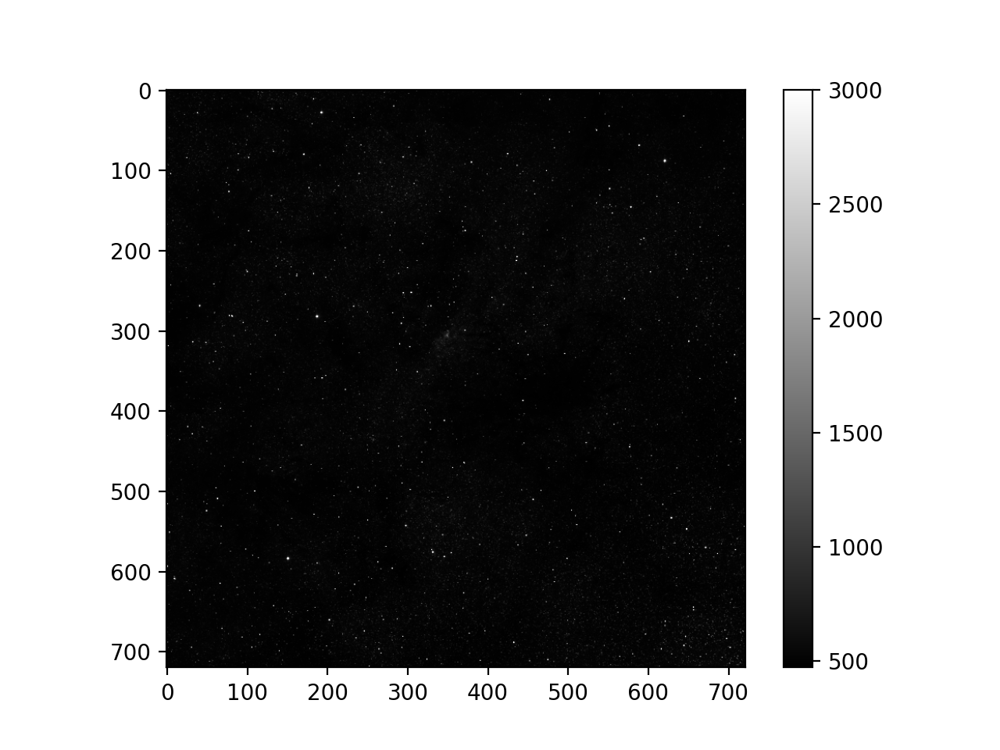
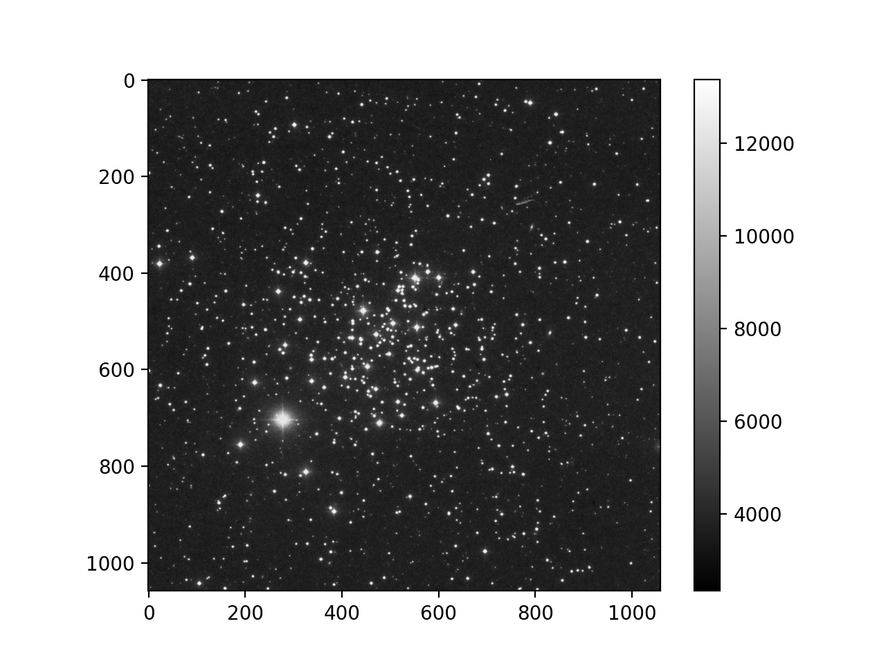
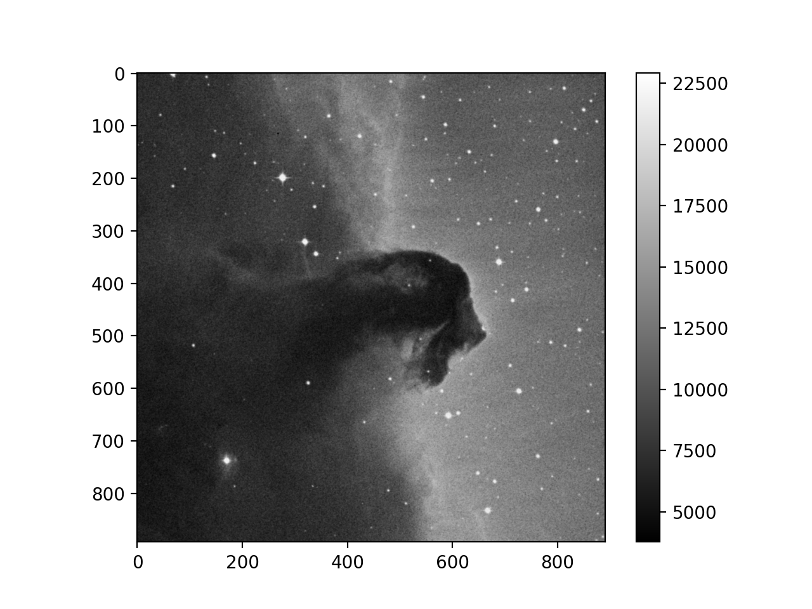

# Astropy Essentials

## FITS: Flexible Image Transport System

The FITS format is used for storing astronomical data in a tabular format. 
- A file in FITS contains a series of __Header Data Units (HDUs)__, each containing two components: an ASCII text header and the binary data.

||||
|---|---|---|
||||


## Installation 
With pip 
 ```
 pip install astropy
 ```
With conda  

```
 conda install astropy
 ```

### Constants
```
 astropy.constants
```

### Gravitational Constant
```
from astropy.constants import G
```
 
### Units and Quantities

```
astropy.units
```


### N-Dimensional Datasets
```
astropy.nddata.CCDData
```

